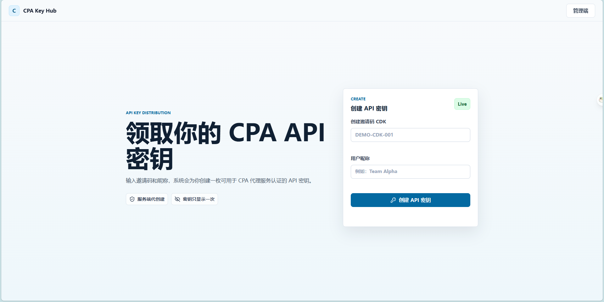
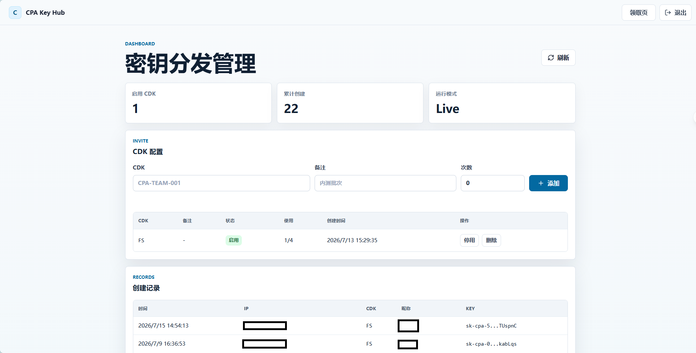

# CPA Key Hub

[](https://github.com/Li7777777/cpa-key-hub/actions/workflows/docker-publish.yml)
[](https://github.com/Li7777777/cpa-key-hub/pkgs/container/cpa-key-hub)

[](https://github.com/Li7777777/cpa-key-hub/commits/main)
[](https://github.com/Li7777777/cpa-key-hub/stargazers)
[](https://linux.do)

[English README](README.md)

CPA Key Hub 是一个轻量 Node.js 分发页面，用邀请码 CDK 为用户创建 CPA API Key。用户在公开页面领取密钥，管理员在后台维护 CDK，并查看领取记录。

Docker 镜像：`ghcr.io/li7777777/cpa-key-hub:latest`

## 界面截图

### 领取页



### 管理后台



## 页面

- 用户领取页：`/`
- 创建成功页：`/success.html`
- 管理端：`/admin.html`

## 使用 Docker 运行

先在服务器上创建 `.env`：

```bash
ADMIN_CDK=change-this-admin-cdk
CPA_MANAGEMENT_BASE_URL=http://host.docker.internal:10059/v0/management
CPA_MANAGEMENT_KEY=change-this-management-key
API_KEY_PREFIX=sk-cpa-
DRY_RUN=false
ADMIN_SESSION_HOURS=12
TRUST_PROXY=false
```

启动前必须修改 `ADMIN_CDK`。当 `DRY_RUN=false` 时，还必须修改 `CPA_MANAGEMENT_KEY`。如果必需的密钥为空或仍使用示例值，服务会拒绝启动。

如果只是本地试用，不想请求 CPA 管理 API，可以设置：

```bash
DRY_RUN=true
```

服务默认启用内存级防爆破：同一客户端在 10 分钟内连续输错 10 次领取 CDK，将锁定 15 分钟；管理员 CDK 连续输错 5 次，将锁定 30 分钟。只有当所有请求都经过可信反向代理，并且代理会覆盖 `X-Forwarded-For` 时，才应设置 `TRUST_PROXY=true`。

系统不再默认启用任何领取 CDK。启动后请先登录管理页创建唯一 CDK；旧数据中仍启用的 `DEMO-CDK-001` 会在启动时自动停用。

拉取镜像：

```bash
docker pull ghcr.io/li7777777/cpa-key-hub:latest
```

运行容器：

```bash
docker run -d \
  --name cpa-key-hub \
  --restart unless-stopped \
  --add-host=host.docker.internal:host-gateway \
  --env-file .env \
  -e HOST=0.0.0.0 \
  -p 10057:10057 \
  -v cpa-key-hub-data:/app/data \
  ghcr.io/li7777777/cpa-key-hub:latest
```

访问：

```text
http://<你的服务器IP>:10057
```

`cpa-key-hub-data` 这个 volume 用来保存 CDK 和领取记录。更新或重建容器时继续挂载它，数据就不会丢。

## Docker Compose

也可以使用 Compose：

```yaml
services:
  cpa-key-hub:
    image: ghcr.io/li7777777/cpa-key-hub:latest
    container_name: cpa-key-hub
    restart: unless-stopped
    extra_hosts:
      - "host.docker.internal:host-gateway"
    env_file:
      - .env
    environment:
      HOST: 0.0.0.0
    ports:
      - "10057:10057"
    volumes:
      - cpa-key-hub-data:/app/data

volumes:
  cpa-key-hub-data:
```

启动：

```bash
docker compose up -d
```

## 常用命令

查看日志：

```bash
docker logs -f cpa-key-hub
```

停止容器：

```bash
docker stop cpa-key-hub
```

再次启动：

```bash
docker start cpa-key-hub
```

更新到最新镜像：

```bash
docker pull ghcr.io/li7777777/cpa-key-hub:latest
docker rm -f cpa-key-hub
docker run -d \
  --name cpa-key-hub \
  --restart unless-stopped \
  --add-host=host.docker.internal:host-gateway \
  --env-file .env \
  -e HOST=0.0.0.0 \
  -p 10057:10057 \
  -v cpa-key-hub-data:/app/data \
  ghcr.io/li7777777/cpa-key-hub:latest
```

## 注意事项

- 容器内必须监听 `0.0.0.0`，上面的命令已经通过 `-e HOST=0.0.0.0` 设置好了。
- 如果 CPA 管理服务跑在同一台机器、但不在这个容器里，需要填写容器能访问到的地址。上面的命令会通过 `--add-host=host.docker.internal:host-gateway` 把 `host.docker.internal` 指向 Docker 宿主机。
- 不要提交 `.env` 或 `data/database.json`，里面会包含运行数据和密钥。
